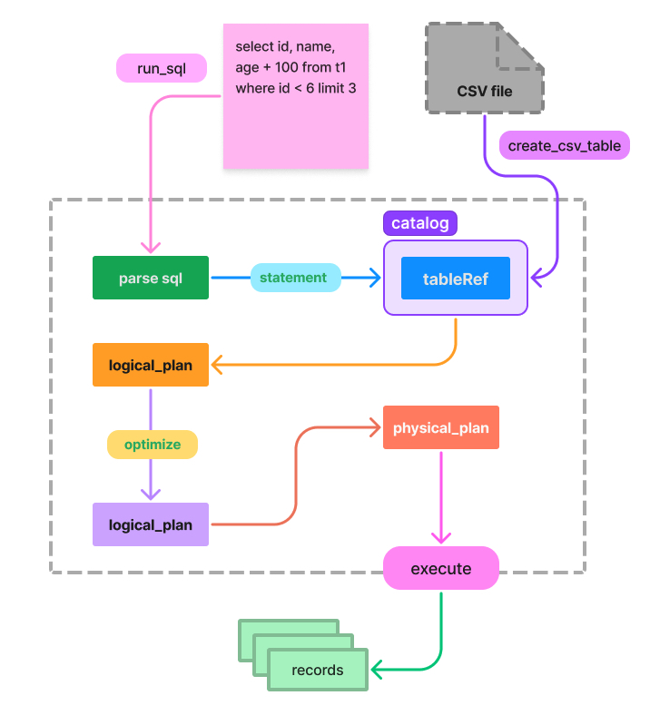

# Naive Query Engine (Toy for Learning) 😄

This is a Query Engine which support `SQL` interface. And it is only a Toy for learn query engine only. You can check [TODO](https://github.com/Veeupup/naive-query-engine#todo) to check the progress now.

Simple enough to learn (Although it is simple...but with so much work to finish.. TAT 😭) and Now it only has a basic architecture and most operators and planners have not implemented (will be done in the future).

This is inspired(and most ideas come) by [how-query-engines-work](https://github.com/andygrove/how-query-engines-work) and it is just for learning purpose. And many ideas inspired by [arrow-datafusion](https://github.com/apache/arrow-datafusion).

Use [arrow](https://github.com/apache/arrow-rs) to express in-memory columnar format and use [sqlparser](https://github.com/sqlparser-rs/sqlparser-rs) as SQL parser.

## architecture



## how to use

for now, we can use `NaiveDB` like below, we can use csv as table storage.

```rust
use naive_db::print_result;
use naive_db::CsvConfig;
use naive_db::NaiveDB;
use naive_db::Result;

fn main() -> Result<()> {
    let mut db = NaiveDB::default();

    db.create_csv_table("t1", "data/test_data.csv", CsvConfig::default())?;

    // select
    let ret = db.run_sql("select id, name, age + 100 from t1 where id < 9 limit 3 offset 2")?;
    print_result(&ret)?;

    // Inner Join
    db.create_csv_table("employee", "data/employee.csv", CsvConfig::default())?;
    db.create_csv_table("rank", "data/rank.csv", CsvConfig::default())?;
    db.create_csv_table("department", "data/department.csv", CsvConfig::default())?;

    let ret = db.run_sql(
        "
        select id, name, rank_name, department_name
        from employee
        join rank on 
            employee.rank = rank.id  
        join department on
            employee.department_id = department.id
    ",
    )?;
    print_result(&ret)?;

    // cross join
    let ret = db.run_sql("select * from employee join rank")?;
    print_result(&ret)?;

    // aggregate
    let ret = db.run_sql(
        "
        select count(id), sum(age), sum(score), avg(score), max(score), min(score) 
        from t1 group by id % 3",
    )?;
    print_result(&ret)?;

    Ok(())
}
```

output will be:

```
+----+-------+-----------+
| id | name  | age + 100 |
+----+-------+-----------+
| 4  | lynne | 118       |
| 5  | alice | 119       |
| 6  | bob   | 120       |
+----+-------+-----------+
+----+-------+-------------+-----------------+
| id | name  | rank_name   | department_name |
+----+-------+-------------+-----------------+
| 2  | lynne | master      | IT              |
| 1  | vee   | diamond     | IT              |
| 3  | Alex  | master      | Marketing       |
| 4  | jack  | diamond     | Marketing       |
| 5  | mike  | grandmaster | Human Resource  |
+----+-------+-------------+-----------------+
+----+-------+---------------+------+----+-------------+
| id | name  | department_id | rank | id | rank_name   |
+----+-------+---------------+------+----+-------------+
| 1  | vee   | 1             | 1    | 1  | master      |
| 2  | lynne | 1             | 0    | 2  | diamond     |
| 3  | Alex  | 2             | 0    | 3  | grandmaster |
| 4  | jack  | 2             | 1    | 4  | master      |
| 5  | mike  | 3             | 2    | 5  | diamond     |
| 1  | vee   | 1             | 1    | 1  | grandmaster |
| 2  | lynne | 1             | 0    | 2  | master      |
| 3  | Alex  | 2             | 0    | 3  | diamond     |
| 4  | jack  | 2             | 1    | 4  | grandmaster |
| 5  | mike  | 3             | 2    | 5  | master      |
| 1  | vee   | 1             | 1    | 1  | diamond     |
| 2  | lynne | 1             | 0    | 2  | grandmaster |
| 3  | Alex  | 2             | 0    | 3  | master      |
| 4  | jack  | 2             | 1    | 4  | diamond     |
| 5  | mike  | 3             | 2    | 5  | grandmaster |
+----+-------+---------------+------+----+-------------+
+-----------+----------+--------------------+-------------------+------------+------------+
| count(id) | sum(age) | sum(score)         | avg(score)        | max(score) | min(score) |
+-----------+----------+--------------------+-------------------+------------+------------+
| 3         | 61       | 255.6              | 85.2              | 90.1       | 81.1       |
| 3         | 62       | 243.29000000000002 | 81.09666666666668 | 99.99      | 60         |
| 2         | 43       | 167.7              | 83.85             | 85.5       | 82.2       |
+-----------+----------+--------------------+-------------------+------------+------------+
```

## architecture

The NaiveDB is just simple and has clear progress just like:

```rust
impl NaiveDB {
    pub fn run_sql(&self, sql: &str) -> Result<Vec<RecordBatch>> {
        // 1. sql -> statement
        let statement = SQLParser::parse(sql)?;
        // 2. statement -> logical plan
        let sql_planner = SQLPlanner::new(&self.catalog);
        let logical_plan = sql_planner.statement_to_plan(statement)?;
        // 3. optimize
        let optimizer = Optimizer::default();
        let logical_plan = optimizer.optimize(logical_plan);
        // 4. logical plan -> physical plan
        let physical_plan = QueryPlanner::create_physical_plan(&logical_plan)?;
        // 5. execute
        physical_plan.execute()
    }
}
```


## TODO

- [x] type system
- [x] datasource
    - [x] mem source
    - [x] csv as datasource
    - [x] empty datasource
- [x] logical plan & expressions
- [ ] build logical plans
    - [x] projection
    - [x] filter
    - [x] aggregate
    - [x] limit
    - [x] join
- [x] physical plan & expressions
    - [x] physical scan
    - [x] physical projection
    - [x] physical filter
    - [x] physical limit
    - [x] join
        - algorithms
            - [x] (dumb😊) nested loop join
            - [x] hash join
            - [ ] sort-merge join
        - [x] inner join
        - [x] cross join
    - [ ] physical expression
        - [x] column expr
        - [x] binary operation expr(add/sub/mul/div/and/or...)
        - [x] literal expr
        - [x] unary expr
        - [x] aggr expr
        - [ ] so many work to do... TAT
- [ ] query planner
    - [x] scan
    - [x] limit
    - [x] join
    - [x] aggregate
    - [ ] ...
- [ ] query optimization
    - [ ] more rules needed
- [ ] sql support
    - [x] parser
    - [ ] SQL planner: statement -> logical plan
        - [x] scan
        - [x] projection
        - [x] selection
        - [x] limit
        - [x] join
        - [x] aggregate
            - [x] group by
        - [ ] scalar function
